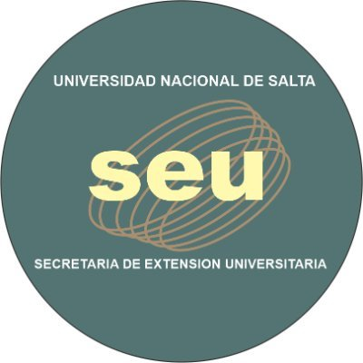

## HSB-TALLER-AED

<table>
<tr>
<td width="33%"">
  

    
    <a href="http://www.manual.net" title="Web de Manuales y Tutoriales de Programación">Ir a Manual Web</a>
  

</td>
<td width="33%">
  

    
    <a href="http://www.manual.net" title="Web de Manuales y Tutoriales de Programación">Ir a Manual Web</a>
  

<td width="33%">
  

    
    <a href="[http://www.manual.net](https://www.unsa.edu.ar/index.php/secretaria-de-extension/)"</a>
  

</td>
</tr>
</table>

# CEUNSA HOSPITAL SAN BERNARDO Salta, Argentina

## Taller ANALISIS EXPLORATORIO DE DATOS - Junio, Julio 2024
* Scritps (Código)
* Jupyter Notebooks (Cuadernos computacionales)
* Datasets de práctica (Datos, información).-
